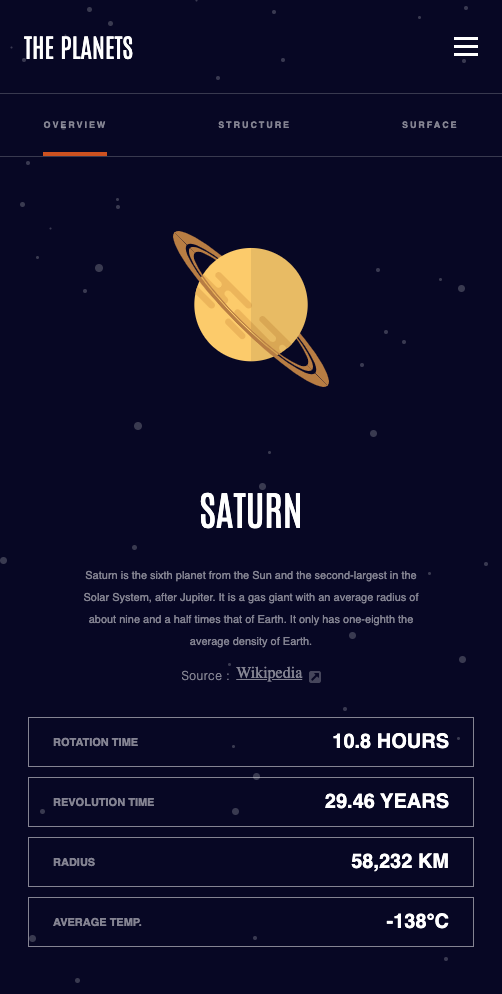
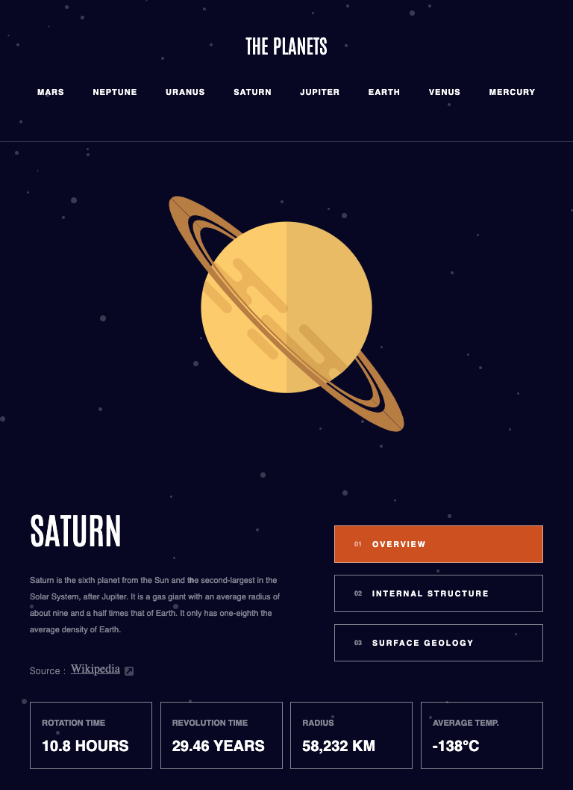
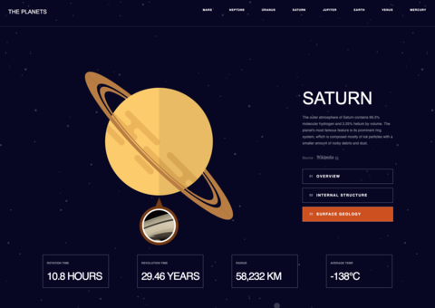

<h3>Planetarium</h3>

Planetarium is a web-based application that lets users explore the solar system and learn about the different planets. The application was built using TypeScript, Next.js, and Contentful, and includes accurate scientific information about the planets.

This project was built using a template from Frontend Masters, which provided a starting point for the development of the application.
Link to the design
https://www.frontendmentor.io/challenges/planets-fact-site-gazqN8w_f

<h3>Why I Built This Project</h3>
I built this project to learn more about web development using TypeScript and Next.js, and to explore the capabilities of the Contentful CMS. My goals for this project included:

Building a responsive user interface that looks good on both desktop and mobile devices
Deployment
Learning how to use Next.js to generate static HTML pages for the application

The deployed version of the application can be accessed at https://planetarium-nine.vercel.app/planets/earth.

<h3>Screenshots and Design Overview</h3>
Here is a screenshot of the Planetarium application:

Planetarium screenshot

<h3>Todo List</h3>
While the Planetarium application is functional, there are still several improvements that could be made:

Fixing and imporoving the mobile menu.

<h3>Installation </h3>
To install and run the Planetarium application on your local machine, follow these steps:

Clone the repository to your local machine:

git clone https://github.com/SupaFlava/planetarium.git
Install the dependencies using npm:

cd planetarium
npm install
Start the development server:

npm run dev
This will start the application at http://localhost:3000. You can access the application by opening this URL in your browser.

To build the production version of the application, use the following command:

npm run build
This will generate a production build of the application in the out directory. You can then deploy this directory to a hosting service of your choice.

That's it! You should now be able to explore the solar system with the Planetarium application.
